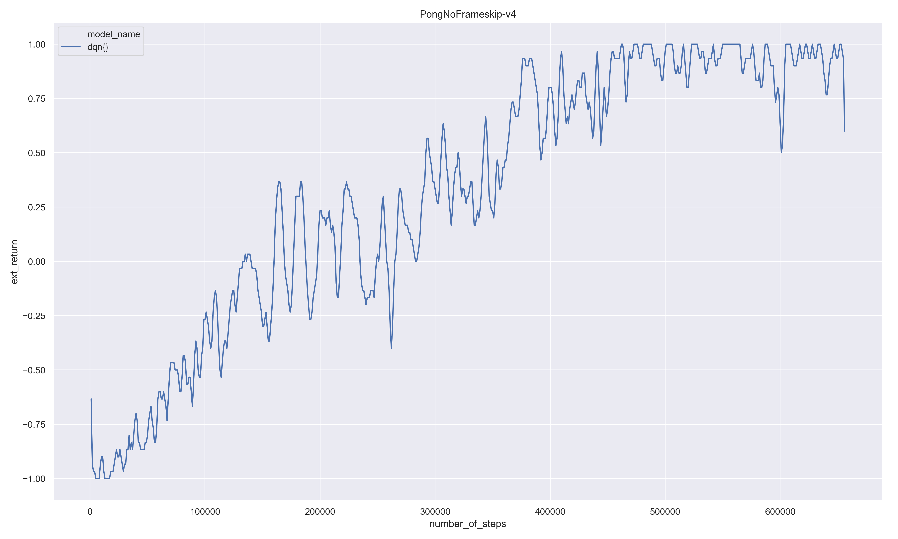

# About
Implementation of PPO, DQN, VPG agenst in Tensorflow to solve Atari Pong and CartPole. 
Some of the agents are also implemented in Tensorflow Eager and PyTorch.

This repository serves the purpose of self-teaching. The implementations 
are not particularly clear, efficient, well tested or numerically stable. We advise 
against using this software for non-didactic purposes.

This software is licensed under the MIT License.

### Installation and Usage
This code is based on [TensorFlow](https://www.tensorflow.org/). Install Python 3 with basic 
packages, then run these commands: 
```Shell
git clone -b master --single-branch https://github.com/RaoulMa/drl.git
python3 -m pip install --user --upgrade pip
python3 -m pip install --user -r requirements.txt 
```

Default hyperparameters are stored in cfg.py, where they can also be modified. To train the model
with default parameters, run the following command:
```Shell
python3 train.py
```

All runs create tensorflow checkpoints and tensorboard event files in the results folder.

### Environment

The gifs below show the original (left) and preprocessed (right) observations for one game play to 
a trained agent. We preprocess each image by resizing, cropping, grayscaling and normalising
to speed up learning. 


### Results
The following plot shows the average reward of the DQN agent while training for 1 million frames/steps. 
Losing or winning yields a reward of -1 or +1. Note, while training the agent epsilon decreases 
from 1 to 0.1 for the first 100000 frames. If we set epsilon to zero the final agent 
has learnt to beat the Pong player more than 90% of the time.


Next, we see the training curve for the PPO agent. Apart from fluctuations the agent's performance converges 
to an average reward of +1 after 3-4 million frames. The final agent has learnt to beat the computer Pong 
player more than 99% of the time. 


### References

[1] Playing Atari with Deep Reinforcement Learning, Mnih et al. arXiv:1312.5602v1  [cs.LG]  19 Dec 2013

[2] Proximal Policy Optimization Algorithms, Schulman et al. 2017 arXiv:1707.06347v2  [cs.LG]  28 Aug 2017